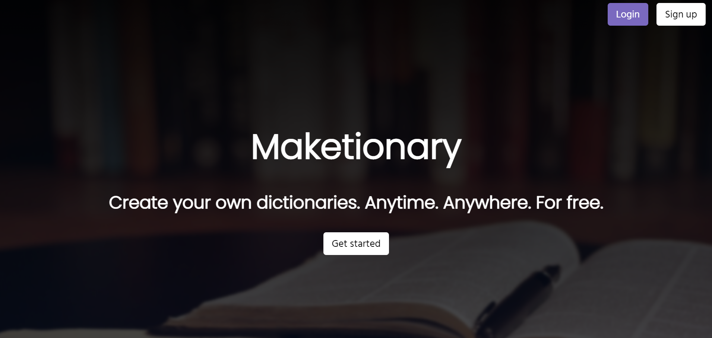
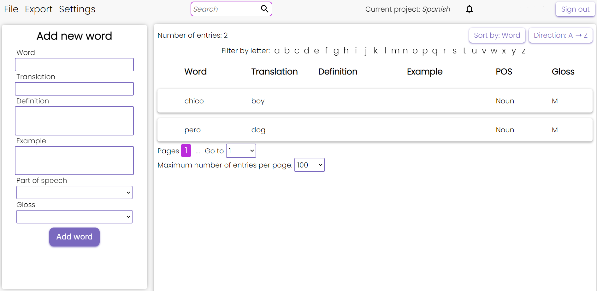

# Maketionary - A dictionnary maker webapp

### [Demo](https://etnms.github.io/Maketionary/)

## Description
Maketionary is a web application that allows you to create dictionaries. You can work alone or in team to create language dictionaries. You can create multiple projects, work with others in real time, or export your dictionaries in multiple formats (.docx, .json, .pdf etc.).

## Features
- Signup/Login, with token authentication
- Includes categories such as word, translation, definition, POS, basic glossing (Leipzig glossing)  
- Multiple filtering options to search quickly for items
- Collaboration: you can have multiple people work on the same project. If multiple people work on the same project at the same time, they contribution will be displayed in a different color
- Possibility to create multiple language projects
- Edition of project names or lexical items
- Export files in multiple formats, including .json, .xml, .rtf, .docx, .pdf
- Notification for team projects: you can be notified when someones invited you on their project
- Light theme/dark theme

## Available in different languages
Maketionary has supports multilingual interfaces. As of now it is available in the following:
- English
- French 

## Languages, frameworks, and databases used
- NodeJS
- MongoDB 
- Typescript/Javascript (ReactJS)
- Redux
- CSS
